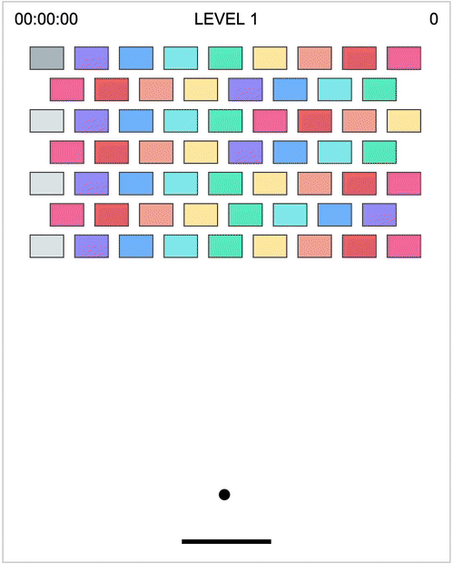

# Hitting Ball
An experimental canvas game using modern web technology.

[demo](http://kmsheng.github.io/hitting-ball)



## Deveolopment
```shell
yarn dev
```

## Production Build
```shell
yarn build
```

## License
This project is licensed under the MIT License - see the [LICENSE](LICENSE) file for details
